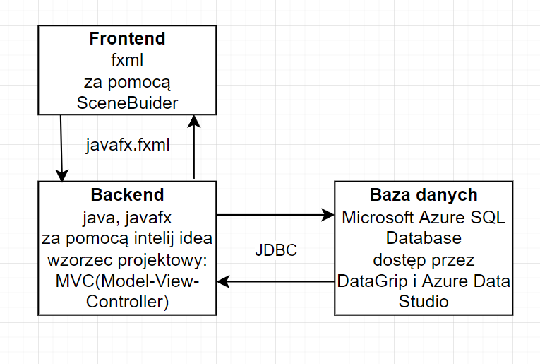
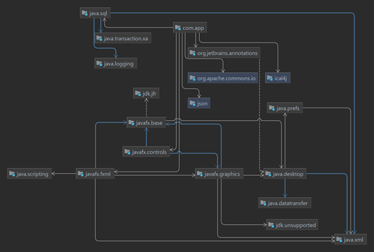

# PAP22L-Z03
Authors:
Emilia Wojtiuk
Jakub Sadowski
Jakub Cimochowski
Jakub Nitkiewicz

Rodzaj aplikacji: desktop    
Nazwa aplikacji: planTask   
Tematyka aplikacji: planer zadań    

Wymagania funkconalne:

Priorytetowe 1 poziomu:
- planer zajęć 
- kalendarz (np święta/ ważne dni)
- wydarzenia bez godzin (np zakładka “cały dzień”)

Priorytetowe 2 poziomu:
- przypominanie o wydarzeniach
- tło wydarzeń ciemne/jasne w zależności od pory dnia
- wydarzenia na “kiedyś”
- wybór osoby używającej aplikacji (jak na Netflixie)

Priorytetowe 3 poziomu:
- pogoda/godziny wschodu i zachodu słońca
- czas na komputerze 

Extra:
- widget
- ścieżki do folderów

Wymagania niefunkcjonalne:

Biblioteka graficzna: javafx    
Biblioteka do połączenia z bazą danych: JDBC    
Rodzaj bazy danych: relacyjna   
Baza danych: Microsoft Azure SQL Database   

PAP22L-Z03
Autorzy: Emilia Wojtiuk, Jakub Sadowski, Jakub Cimochowski, Jakub Nitkiewicz

**Prezentacja projektu na etap I**

Diagram z głównymi warstwami aplikacji

Projekt na chwilę obecną
Na moment obecny nasz projekt składa się z czterech pakietów app, ICSFiles, loginapp, WeatherInfo. Pakiet app zawiera klasy: App, AppPanel, Calendar, Planner, Settings, Statistics. Wykorzystywane są przy tworzeniu aplikacji, która ma ukazać się użytkownikowi po zalogowaniu. Pakiet ICSFiles zawiera klasy ICSFilesReader oraz ToICSFileWritter. Klasy te służą do czytania oraz zapisywania plików z rozszerzeniem ics. Pakiet loginapp posiada klasy: Database, LoginApplication, LoginController, LoginPanelControler, RegisterController, User. Używane są do tworzenia panelu logowania oraz rejestracji, który to łączy się z bazą danych. Pakiet WeatherInfo posiada klasy JsonHandling oraz WeatherInfo. Korzystamy z nich w celu uzyskania aktualnych danych meteorologicznych poprzez api korzystające z kodu pocztowego. 

Wymagania środowiskowe i instrukcja zbudowania i uruchomienia aplikacji z kodu źródłowego

Nasz zespół korzysta ze zintegrowanego środowiska programistycznego InteliJ IDEA dlatego też najwygodniej przy uruchomieniu aplikacji z kodu źródłowego jest go użyć. Wszystkie zewnętrzne biblioteki dodane są do Mavena. Program do działania potrzebuje SDK Oracle Openjdk version 17.0.2. W samej aplikacji znajdują się dwie klasy z funkcjami main App oraz LogginApplication. Pierwsza wyświetla to co ma zobaczyć użytkownik po zalogowaniu natomiast druga uruchamia logownie
Diagram z Mavena:
 

